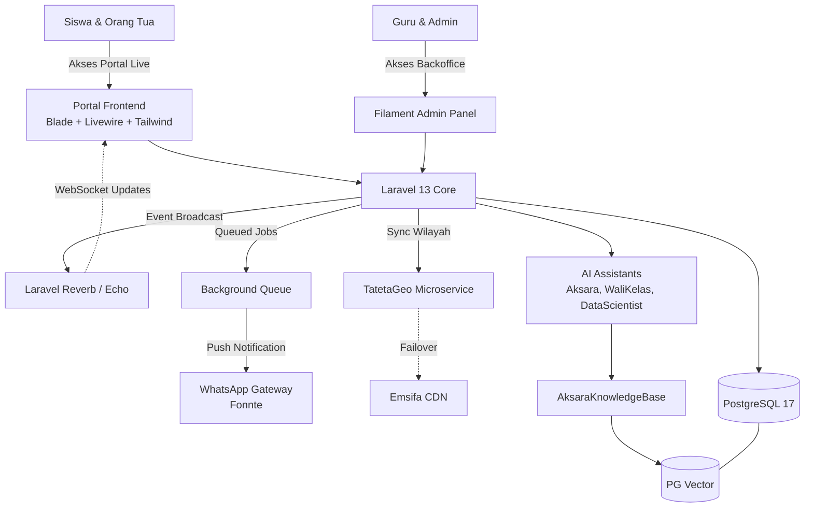
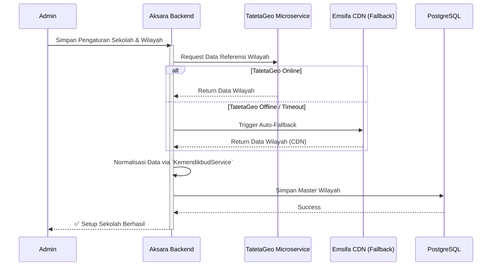
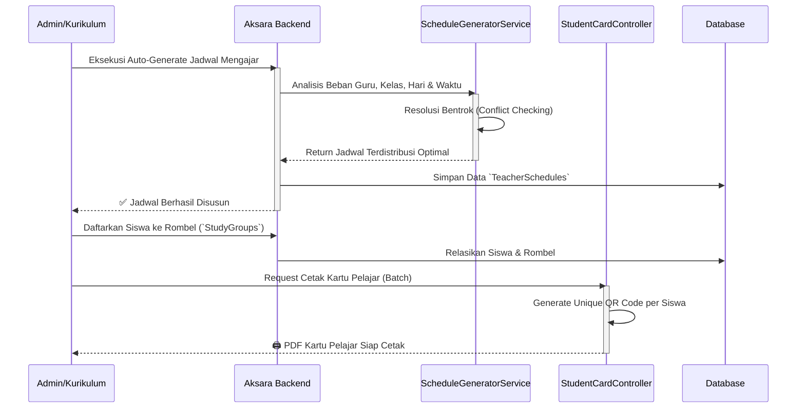
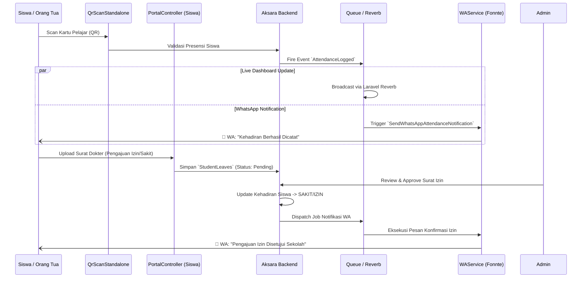
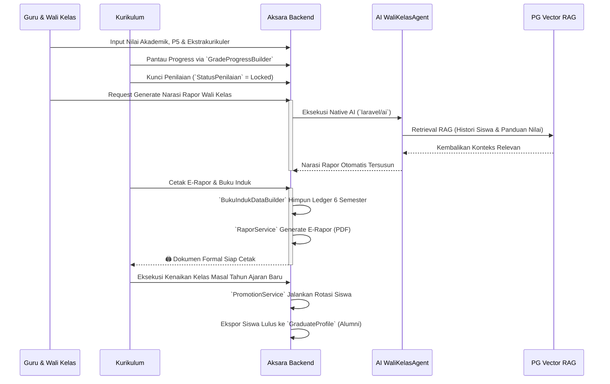

<div align="center">

# AKSARA


Aksara adalah sistem manajemen sekolah yang dirancang untuk menjadi pusat data pendidikan yang dinamis, akurat, dan transparan. Proyek ini menggabungkan kekuatan **Filament PHP** untuk manajemen data tingkat tinggi dengan **Portal Kustom** yang intuitif bagi siswa dan orang tua.

</div>

---

## 🚀 Fitur Utama

-   **QR Attendance & WA Gateway (Fonnte)**: Sistem absensi berbasis QR Code (*Kiosk Standalone*) yang otomatis me-*trigger* *Background Jobs* untuk mengirimkan notifikasi WhatsApp *realtime* ke orang tua tanpa membebani *server* utama.
-   **Native AI-Powered Ecosystem (PG Vector RAG)**: Aksara mengemas 3 lapis asisten cerdas secara *native* dalam ekosistem PHP melalui `laravel/ai` (tanpa microservice Python terpisah): `AksaraAssistant` (Chatbot Portal Edukasi), `WaliKelasAgent` (Pembuat narasi Rapor otomatis), dan `DataScientistAssistant` (Analitik performa sekolah).
-   **Portal Live Dashboard (WebSockets)**: Ekosistem antarmuka (*frontend*) mandiri bagi Siswa dan Wali Murid. Menampilkan pembaruan jadwal akademik, absensi, dan nilai secara seketika (*realtime*) memanfaatkan **Laravel Reverb & Echo**.
-   **Evaluasi Akademik & Kurikulum Merdeka (P5)**: Mendukung arsitektur Kurikulum Merdeka (Tema & Proyek P5) serta Ekstrakurikuler, dilengkapi fitur **Grade Monitoring** sentral yang menggunakan mekanisme penguncian (*Status Lock*).
-   **Manajemen Buku Induk Otomatis**: Integrasi `BukuIndukService` yang langsung menghimpun *ledger* (buku besar) nilai 6 semester siswa secara otomatis, dipadukan dengan modul cetak **E-Rapor PDF** pintar.
-   **Hybrid Authentication & Impersonation**: Sistem pembagian peran (RBAC Filament Shield) adaptif dengan kemampuan **Login As** (`ImpersonateController`), mempermudah *Super Admin* menguji *platform* dari kacamata *user* manapun.
-   **Antarmuka Premium Cepat**: Dibangun di atas fondasi Filament PHP ~5.0 untuk panel *Backoffice* yang elegan dan Tailwind CSS 4.0 pada *Frontend* Portal.

---

## 🌟 Pembaruan & Peningkatan Sistem Terkini

-   **Live Grade Progress Tracker**: Kurikulum dan Kepala Sekolah kini bisa melacak (*track*) secara instan guru mana yang belum menyelesaikan pengisian nilai, dipermudah lewat visualisasi *Gauge UI* di *dashboard* admin.
-   **Integrasi Wilayah Cerdas (TatetaGeo & Kemendikbud)**: Pencarian referensi wilayah & sekolah distandarisasi lewat panggilan *service* terpusat menggunakan mikroservis **TatetaGeo** dan *fallback* mulus ke Emsifa CDN.
-   **Otomatisasi Kenaikan Kelas & Alumni**: Kehadiran `PromotionService` merampingkan proses rotasi tahun ajaran baru, pendaftaran kelas masal, hingga pengarsipan rekam jejak alumni di modul *Graduate Profile*.
-   **Cetak Kartu Pelajar (QR Generation)**: Admin maupun Tata Usaha dapat dengan mudah mengekspor kartu ID ber-QR unik siap cetak secara *batch* untuk ribuan siswa (`StudentCardController`).
-   **Pusat Kendali Penugasan Mengajar Dinamis**: Resolusi bentrok jadwal guru otomatis tertangani di balik layar oleh *Schedule Generator Service*, yang mencocokkan jam mengajar, ruang kelas, dan mata pelajaran tanpa benturan (*clash*).
-   **Manajemen Cuti & Izin Terpadu**: Pengajuan izin sakit/absen siswa (beserta surat dokter) dapat dikirim *online* melalui portal siswa, dan langsung ditindaklanjuti/divalidasi oleh guru bersangkutan (*Student Leaves*).

---

## 📚 Dokumentasi & Panduan

Untuk pemahaman sistem yang lebih mendalam, silakan pelajari dokumen internal berikut di dalam direktori `/docs`:
- [**Panduan Alur Penggunaan (User Flow)**](./docs/flow_penggunaan.md) — Alur operasional sistem mulai dari setup awal, KBM, hingga cetak Rapor.
- [**Development Roadmap & Architecture**](./docs/DEV_DOCS.md) — Pembagian tugas teknis, arsitektur *Native* AI, dan *workflow* pengembangan.

---

## 🛠️ Tech Stack

| Komponen            | Teknologi              | Versi    |
| ------------------- | ---------------------- | -------- |
| **Framework**       | Laravel                | 13.x     |
| **Admin Panel**     | Filament PHP           | ~5.0     |
| **Database**        | PostgreSQL (PG Vector) | 17       |
| **AI Engine**       | Native Laravel AI      | ^0.6.7   |
| **Styling**         | Tailwind CSS           | 4.0      |
| **RBAC**            | Filament Shield        | ^4.2     |
| **Runtime**         | PHP                    | 8.3+     |
| **Dev Tool**        | Laravel IDE Helper     |## 📊 Arsitektur & Alur Sistem (Mermaid Diagrams)

### 1. Arsitektur Komponen Utama


### 2. Alur Master Data & Sinkronisasi Wilayah (Setup Awal)


### 3. Alur Penjadwalan Dinamis & Cetak Kartu Pelajar (Persiapan KBM)


### 4. Alur Operasional Harian: Absensi, Perizinan & WhatsApp Realtime


### 5. Alur Evaluasi Akademik, AI Rapor & Kenaikan Kelas (Akhir Semester)


---

## ⚙️ Instalasi & Setup Lengkap

Ikuti langkah-langkah di bawah ini untuk menjalankan Aksara di lingkungan lokal Anda. Pastikan sistem Anda memenuhi **Requirement Minimum: PHP 8.3+, Node 20+, & PostgreSQL 17**.

### 1. Kloning & Instalasi
Dapatkan kode sumber dan instal semua dependensi yang diperlukan:

```bash
# Clone repository
git clone https://github.com/itsnacla/Aksara.git
cd Aksara

# Metode A: Setup Otomatis (Direkomendasikan)
composer setup

# Metode B: Instalasi Manual
composer install
npm install
```

### 2. Konfigurasi Environment (`.env`)
Salin file environment dan buat Application Key:

```bash
cp .env.example .env
php artisan key:generate
```

> [!IMPORTANT]
> Buka file `.env` dan sesuaikan bagian database:
> `DB_CONNECTION=pgsql`, `DB_DATABASE=nama_db`, `DB_USERNAME=postgres`, `DB_PASSWORD=password`.

### 3. Aktivasi PG Vector (Krusial)
Aksara membutuhkan ekstensi **pgvector** untuk fitur AI. Pastikan ekstensi ini diaktifkan di PostgreSQL Anda:

```sql
-- Jalankan di SQL Console / pgAdmin
CREATE EXTENSION IF NOT EXISTS vector;
```

### 4. Link Storage & Filament Assets
Langkah ini wajib agar UI Filament dan file upload (avatar/media) tampil dengan benar:

```bash
# Menghubungkan storage (untuk media/upload)
php artisan storage:link

# Re-publish assets Filament terbaru
php artisan filament:assets
php artisan filament:upgrade
```

### 5. Inisialisasi Security & Data Demo
Bangun skema database dan jalankan seeder utama yang mencakup *Master Data*, *Waktu/Jam Pelajaran*, *Peran*, dan data sampel:

```bash
# Fresh migration dan jalankan seluruh seeder otomatis
php artisan migrate:fresh --seed

# Generate permissions & policies (Filament Shield)
php artisan shield:generate --all --panel=admin --no-interaction
```

### 6. Integrasi TatetaGeo & Database Wilayah Lokal (100% Offline)
Aksara terintegrasi dengan **TatetaGeo** untuk menyajikan data wilayah administrasi Indonesia secara dinamis dan cepat. Untuk performa terbaik dan kelancaran operasional tanpa hambatan jaringan, Aksara mendukung **sistem wilayah 100% offline (Local JSON Database)**.

Cukup konfigurasikan variabel berikut pada file `.env` Aksara Anda untuk menghubungkan ke instance TatetaGeo Anda:
- `TATETA_GEO_URL=https://geo.tateta.samastanuswantara.com/api/v1/geo` (URL tempat TatetaGeo di-serve)
- `TATETA_GEO_TOKEN=` (Token API Sanctum Anda)

Setelah `.env` terkonfigurasi, jalankan perintah Artisan berikut untuk mengunduh seluruh data wilayah ke dalam database JSON lokal proyek Anda:
```bash
php artisan geo:download-local
```
Perintah ini akan mengunduh data Provinsi, Kabupaten, Kecamatan, dan Desa se-Indonesia sekali saja, lalu membaginya per file provinsi ke dalam direktori `storage/app/geo/`. Setelah itu, `RegionService` secara otomatis akan melayani form alamat/wilayah secara instan (latency 0ms) dari lokal tanpa bergantung pada koneksi internet.

> [!TIP]
> **Mekanisme Failover & Caching Otomatis**: Jika data lokal belum terunduh, sistem tetap memiliki fallback dinamis ke TatetaGeo API dan Emsifa CDN, lengkap dengan Circuit Breaker 5 menit di sisi server untuk mencegah delay timeout jika layanan API eksternal sedang mati.

---

## 🔑 Akun Akses Default
Gunakan password default: **`password`** untuk semua akun berikut:

### 1. Akun Staff & Pendidik (Static Seeder)

| Role | Username / Email | Dasbor Akses | Keterangan |
| :--- | :--- | :--- | :--- |
| **Super Admin** | `admin@aksara.com` / `admin` | `/admin` | Akses penuh sistem |
| **Guru Wali** | `eni@aksara.com` / `eni` | `/admin` | Wali Kelas 1 - A (Eni Nuryanti) |
| **Guru Mapel** | `beni@aksara.com` / `beni` | `/admin` | Guru PJOK (Beni Putra) |
| **Staff TU** | `sarah@aksara.com` / `sarah` | `/admin` | Bendahara (Siti Sarah) |

---

### 2. Akun Siswa & Wali (Dynamic Seeder)
Untuk menjaga keamanan data dan menyimulasikan sekolah nyata, akun **Siswa** dan **Wali** dibuat secara dinamis menggunakan domain **`@aksara.samastanuswantara.com`** dengan format sebagai berikut:

*   **Akun Siswa**:
    *   **Format Email**: `[namasiswa]_[hash]_[no]@aksara.samastanuswantara.com` (Contoh: `ahmadsaputra_7af3d2_1@aksara.samastanuswantara.com`)
    *   **Username**: `[namasiswa]_[hash]_[no]` (Contoh: `ahmadsaputra_7af3d2_1`)
    *   **Dasbor Akses**: `/dashboard` (Portal Siswa)
*   **Akun Wali / Orang Tua**:
    *   **Format Email**: `wali_[siswa_username]@aksara.samastanuswantara.com` (Contoh: `wali_ahmadsaputra_7af3d2_1@aksara.samastanuswantara.com`)
    *   **Username**: `wali_[siswa_username]` (Contoh: `wali_ahmadsaputra_7af3d2_1`)
    *   **Dasbor Akses**: `/dashboard` (Portal Wali)

> [!NOTE]
> Anda dapat melihat daftar lengkap siswa dan wali kelas yang terdaftar langsung melalui Panel Admin di menu **Siswa** atau **Wali** untuk mengambil email uji coba secara spesifik.

---

## 🚀 Menjalankan Aplikasi
Gunakan skrip pengembangan terpadu dari Composer yang akan otomatis menjalankan **Server Laravel**, **Queue Worker** (untuk notifikasi WA), dan **Vite** secara serentak dalam satu terminal:

```bash
composer dev
```

Aplikasi dapat diakses di `http://localhost:8000/admin` (Admin) atau `http://localhost:8000/dashboard` (Siswa/Wali).

---

## 👥 Authors

Proyek ini dikembangkan dengan dedikasi oleh:

-   [](https://github.com/septiandwica)
-   [](https://github.com/itsnacla)
-   [](https://github.com/nadakmlia)

---

Developed for **Samasta Teknologi Nuswantara**.