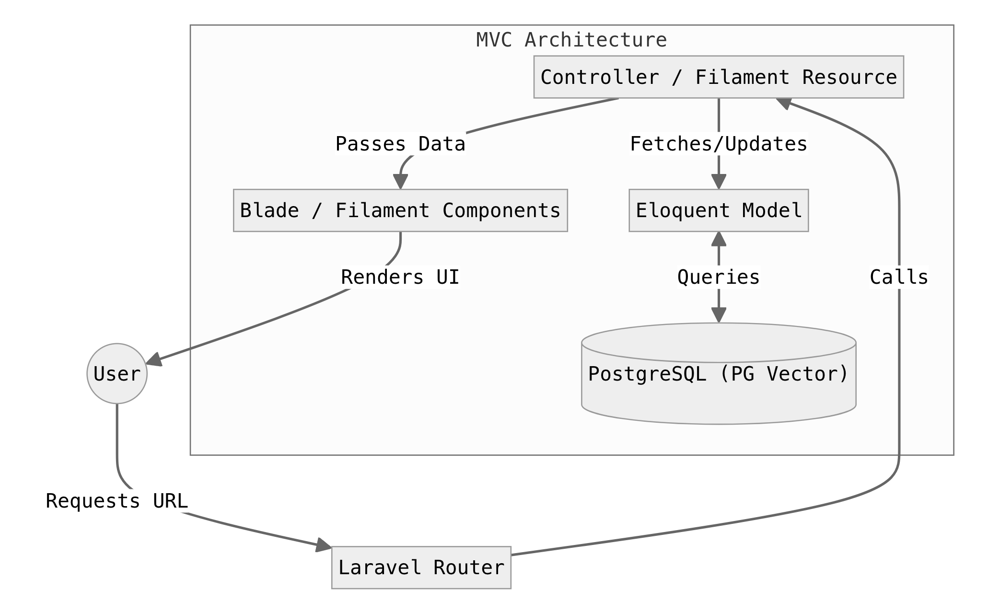

# AKSARA

Aksara adalah sistem manajemen sekolah yang dirancang untuk menjadi pusat data pendidikan yang dinamis, akurat, dan transparan. Proyek ini menggabungkan kekuatan **Filament PHP** untuk manajemen data tingkat tinggi dengan **Portal Kustom** yang intuitif bagi siswa dan orang tua.

---

## 🚀 Fitur Utama

-   **QR Attendance & WA Notification**: Sistem absensi berbasis QR Code yang secara otomatis mengirimkan notifikasi WhatsApp ke orang tua/wali murid secara real-time.
-   **AI-Powered Architecture**: Menggunakan PostgreSQL dengan ekstensi **PG Vector** untuk mempersiapkan fitur AI masa depan seperti pencarian semantik dan analisis data pendidikan yang cerdas.
-   **Hybrid Authentication Flow**: Sistem cerdas yang mendeteksi peran pengguna secara otomatis dan mengarahkan mereka ke dasbor yang sesuai (Filament Panel untuk Admin/Guru vs Custom Portal untuk Siswa/Siswa).
-   **Manajemen Akademik Terintegrasi**: Pengaturan Tahun Ajaran, Semester, dan Tingkatan Kelas yang fleksibel.
-   **RBAC (Role-Based Access Control)**: Menggunakan Filament Shield untuk pembatasan akses yang ketat (Admin, Guru, Staff, Siswa, Wali).
-   **Manajer Relasi Siswa & Wali**: Koneksi otomatis antara data siswa dengan profil orang tua mereka.
-   **Penugasan Wali Kelas**: Sistem penugasan guru ke kelas dengan validasi otomatis.
-   **Antarmuka Premium**: Menggunakan Tailwind CSS 4 dan Filament v3/v5 untuk pengalaman pengguna yang modern dan cepat.

---

## 🌟 Pembaruan & Peningkatan Sistem Terkini

-   **Pusat Kendali WhatsApp Gateway Terintegrasi**: Halaman manajemen **WA Notifikasi** mandiri di dalam panel Filament yang mendukung multi-provider (Fonnte & Custom API Gateway) lengkap dengan kustomisasi parameter dan token otorisasi.
-   **Notifikasi Absensi Latar Belakang (Real-time Queued)**: Pengiriman otomatis pesan WhatsApp terformat rapi ke orang tua/wali murid saat siswa memindai kartu presensi (masuk/pulang). Dilengkapi dengan penamaan sekolah dinamis pada *header* dan *branding* elegan (`Powered by Aksara | Tateta`) pada *footer*, diproses asinkron di latar belakang (*Job/Queue*) tanpa membebani kecepatan pemindaian.
-   **Pemindai QR Mandiri Anti-Duplikasi (Kiosk Mode)**: Modul pemindai presensi mandiri yang dapat diakses di tab terpisah untuk mencegah bentrok elemen Livewire. Dilengkapi dengan proteksi ganda berupa **Cooldown Klien (5 detik)** dan **Cooldown Server (10 detik)** guna mengatasi *race condition*, serta memprioritaskan privasi siswa dengan menghapus *fallback* avatar pihak ketiga.
-   **Mesin Siaran Pengumuman (Broadcast Engine)**: Memungkinkan staf atau pengelola sekolah untuk mengirimkan pengumuman penting secara massal ke seluruh orang tua, maupun difilter spesifik berdasarkan **Rombel/Kelas** tertentu.

---

## 🛠️ Tech Stack

| Komponen            | Teknologi              | Versi    |
| ------------------- | ---------------------- | -------- |
| **Framework**       | Laravel                | 13.x     |
| **Admin Panel**     | Filament PHP           | ~5.0     |
| **Database**        | PostgreSQL (PG Vector) | 16+      |
| **Styling**         | Tailwind CSS           | 4.0      |
| **RBAC**            | Filament Shield        | ^4.2     |
| **Runtime**         | PHP                    | 8.4+     |
| **Dev Tool**        | Laravel IDE Helper     | ^3.7     |

---

## 📊 MVC Flow Chart (Basic)



---

## ⚙️ Instalasi & Setup Lengkap

Ikuti langkah-langkah di bawah ini untuk menjalankan Aksara di lingkungan lokal Anda. Pastikan sistem Anda memenuhi **Requirement Minimum: PHP 8.4, Node 20+, & PostgreSQL 16**.

### 1. Kloning & Instalasi
Dapatkan kode sumber dan instal semua dependensi yang diperlukan:

```bash
# Clone repository
git clone https://github.com/itsnacla/Aksara.git
cd Aksara

# Metode A: Setup Otomatis (Direkomendasikan)
composer setup

# Metode B: Instalasi Manual
composer install
npm install
```

### 2. Konfigurasi Environment (`.env`)
Salin file environment dan buat Application Key:

```bash
cp .env.example .env
php artisan key:generate
```

> [!IMPORTANT]
> Buka file `.env` dan sesuaikan bagian database:
> `DB_CONNECTION=pgsql`, `DB_DATABASE=nama_db`, `DB_USERNAME=postgres`, `DB_PASSWORD=password`.

### 3. Aktivasi PG Vector (Krusial)
Aksara membutuhkan ekstensi **pgvector** untuk fitur AI. Pastikan ekstensi ini diaktifkan di PostgreSQL Anda:

```sql
-- Jalankan di SQL Console / pgAdmin
CREATE EXTENSION IF NOT EXISTS vector;
```

### 4. Link Storage & Filament Assets
Langkah ini wajib agar UI Filament dan file upload (avatar/media) tampil dengan benar:

```bash
# Menghubungkan storage (untuk media/upload)
php artisan storage:link

# Re-publish assets Filament terbaru
php artisan filament:assets
php artisan filament:upgrade
```

### 5. Inisialisasi Security & Data Demo
Bangun skema database dan jalankan seeder utama yang mencakup *Master Data*, *Waktu/Jam Pelajaran*, *Peran*, dan data sampel:

```bash
# Fresh migration dan jalankan seluruh seeder otomatis
php artisan migrate:fresh --seed

# Generate permissions & policies (Filament Shield)
php artisan shield:generate --all --panel=admin --no-interaction
```

---

## 🔑 Akun Akses Default
Gunakan password default: **`password`** untuk semua akun berikut:

| Role        | Username / Email                     | Dasbor Akses         | Keterangan           |
| ----------- | ------------------------------------ | -------------------- | -------------------- |
| Super Admin | `admin@aksara.com`                   | `/admin`             | Akses penuh          |
| Guru Wali   | `eni@aksara.com`                     | `/admin`             | Wali Kelas 1         |
| Guru Mapel  | `beni@aksara.com`                    | `/admin`             | Guru PJOK            |
| Staff TU    | `sarah@aksara.com`                   | `/admin`             | Bendahara            |
| Wali/Parent | `walisiswakelas1-ruang1no1@aksara.com`| `/dashboard` (Portal)| Orang Tua Siswa No 1 |
| Siswa       | `siswakelas1-ruang1no1@aksara.com`   | `/dashboard` (Portal)| Siswa Kelas 1 No 1   |

> [!NOTE]
> Tersedia juga puluhan akun guru lain (seperti `rusti@aksara.com`, `alex@aksara.com`) serta siswa dari nomor 1 hingga 20 di setiap kelas.

---

## 🚀 Menjalankan Aplikasi
Gunakan skrip pengembangan terpadu dari Composer yang akan otomatis menjalankan **Server Laravel**, **Queue Worker** (untuk notifikasi WA), dan **Vite** secara serentak dalam satu terminal:

```bash
composer dev
```

Aplikasi dapat diakses di `http://localhost:8000/admin` (Admin) atau `http://localhost:8000/dashboard` (Siswa/Wali).

---

## 👥 Authors

Proyek ini dikembangkan dengan dedikasi oleh:

-   [](https://github.com/septiandwica)
-   [](https://github.com/itsnacla)
-   [](https://github.com/nadakmlia)

---

Developed for **Samasta Teknologi Nuswantara**.