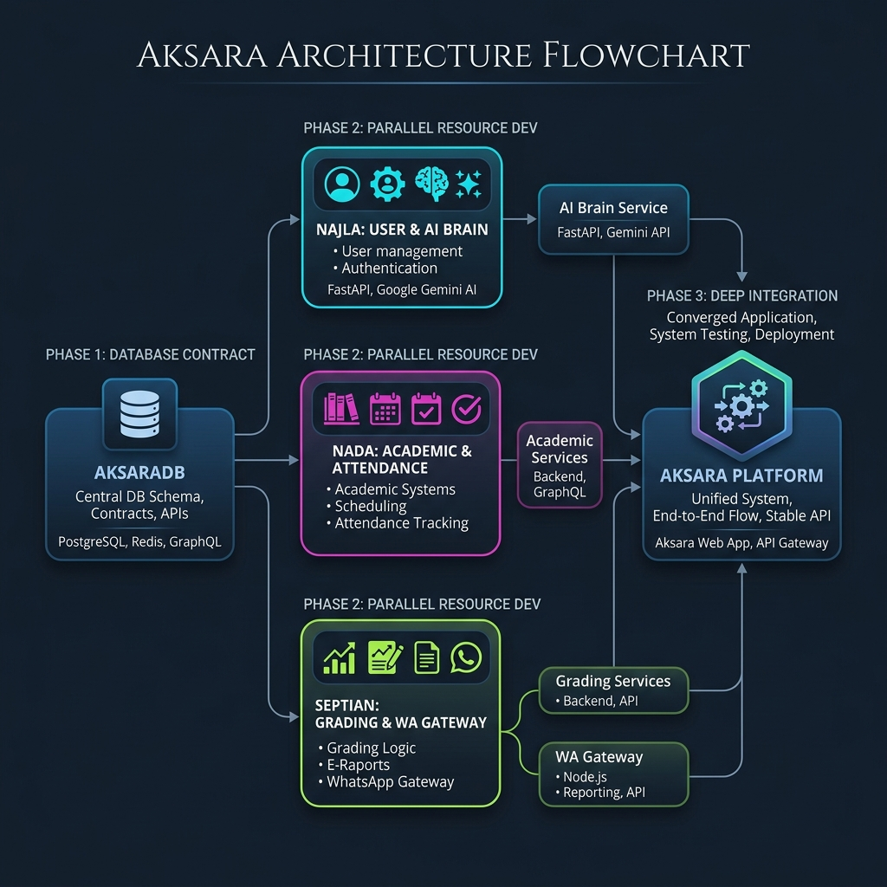

# Aksara Development Roadmap & Division

Dokumen ini menjelaskan pembagian tugas pengembangan proyek **Aksara** dan alur kerja (workflow) untuk memastikan setiap pengembang dapat bekerja secara paralel tanpa saling menghambat (*blocking*).

## Tech Stack Analysis
Berdasarkan investigasi pada codebase, proyek Aksara menggunakan:
*   **Core**: Laravel 12 & PHP 8.4+
*   **Database**: PostgreSQL 16 dengan ekstensi **PG Vector** (untuk fitur AI).
*   **Admin/Control Panel**: **Filament v5** (Resource-based UI).
*   **Styling**: Tailwind CSS 4.
*   **Security**: Filament Shield (Spatie Permission) untuk RBAC.
*   **Communication**: Integrasi WhatsApp & Email (SMTP).

---

## 👥 Refined Division (Pembagian Tugas)

Untuk memaksimalkan **Filament Resources** dan meminimalisir konflik, berikut adalah pembagian yang lebih detail:

### 1. Najla (User & Intelligent Workspace)
Fokus pada fondasi entitas manusia dan "AI Brain" berbasis Python.
*   **User Management & RBAC**: `User`, Core Profiles, dan Shield configuration.
*   **Python AI Service**: Membangun microservice terpisah menggunakan **FastAPI**. Dipilih karena performanya yang tinggi dan dukungan *asynchronous* yang sangat baik untuk API Gemini.
*   **Concept**: Laravel mengirim data (CSV/JSON) ke FastAPI -> FastAPI melakukan analisis (RAG/Text-to-SQL) -> Hasil dikirim balik ke Dashboard Laravel.
*   **Insight Dashboard**: Visualisasi rekomendasi akademik berdasarkan output dari engine Python.

### 2. Nada (Academic & Operations)
Fokus pada organisasi data sebagai "penyuplai" informasi untuk AI.
*   **Master Data**: `Level`, `AcademicYear`, `Classroom`, `Subject`.
*   **Operations**: `Attendance` (QR-based) dan `Schedule`. Data ini dikirim secara berkala ke service Python Najla.

### 3. Septian (Evaluation & Communication)
Fokus pada output dan jembatan komunikasi.
*   **Grading & Reporting**: Input nilai dan generasi E-Raport (PDF).
*   **WhatsApp Cloud API Hub**: Implementasi WA Gateway yang **Official & Free Tier**. 
*   **Branding**: Menggunakan identitas pusat (`tateta.samastanuswantara.com`) untuk pendaftaran Meta Business Platform.

---

## 🔄 Parallel Workflow (Alur Kerja Paralel)

Agar bisa bekerja tanpa menunggu satu sama lain, kita menggunakan pendekatan **"Contract-First Development"**.

### Alur Kerja:

### Strategi Menghindari Blocking:

1.  **Shared Model Layer**: Migrasi dan Model dasar harus diselesaikan dan di-*merge* ke branch `development` terlebih dahulu. Begitu `Student`, `Subject`, dan `Classroom` sudah ada di database, Septian bisa langsung mengerjakan `Grade` meskipun UI Nada belum selesai.
2.  **Filament Resource Isolation**: Karena setiap fitur di Filament adalah satu file Resource (misal: `StudentResource.php`, `AttendanceResource.php`), tidak akan ada konflik kode saat mengerjakan fitur yang berbeda.
3.  **Mock Data / Seeding**: Gunakan `DatabaseSeeder` untuk membuat data dummy. Misal: Septian butuh data kelas untuk ngetes raport, dia bisa buat seeder kelas sendiri tanpa nunggu Nada input manual di UI.

## Technical Decision: FastAPI & Central Meta Verification

> [!NOTE]
> **Why FastAPI?**:
> Direkomendasikan menggunakan **FastAPI** dibanding Flask karena mendukung *Asynchronous* secara native. Ini sangat penting saat memanggil API Gemini agar sistem tidak "freeze" saat menunggu jawaban AI. FastAPI juga otomatis menyediakan dokumentasi API (Swagger).
>
> **WhatsApp SaaS Branding**:
> Menggunakan brand pusat **Tateta** untuk pendaftaran Meta Business Platform. Verifikasi domain `tateta.samastanuswantara.com` memungkinkan pengelolaan banyak nomor untuk berbagai sekolah.
>
> **Plan B: Unofficial Wrapping Mode (Cadangan)**:
> Sebagai cadangan jika jalur resmi terlalu kaku, dapat menggunakan **Self-Hosted WhatsApp Bridge** (seperti *Evolution API* atau *Baileys*).
> *   **Solusi Mitigasi Banned**: Menggunakan Throttling (jeda 10-30 detik), proses Warming Up nomor, dan Interactive Messaging (pancing balasan user).

---

## 🛠️ Verification Plan
### Automated Tests
*   `php artisan test` untuk memastikan migrasi dan hubungan antar model tidak rusak.
### Manual Verification
*   Pengecekan navigasi Filament untuk memastikan setiap modul (User, Academic, Grading) muncul dengan izin yang sesuai.
